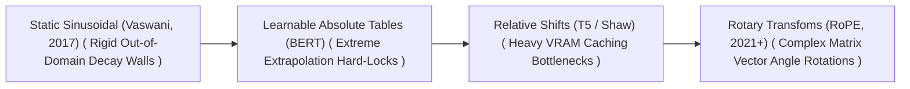
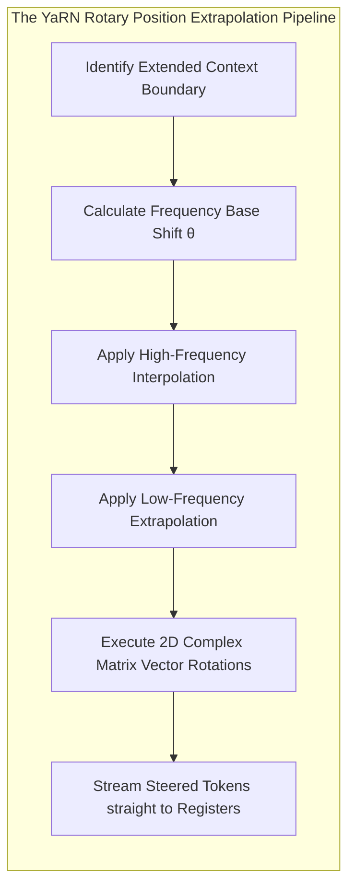

🚀 # Awesome-Position-Embedding 🌟

**SEO Meta Description:** A comprehensive and awesome curated list of position embedding techniques, including RoPE, Alibi, and relative bias, for Transformer neural networks and Large Language Models.

🧠 ## Position Embedding in AI: History, Progression, Variants, & Applications

**Position Embedding**—alternatively designated as positional encoding, coordinate sequence injection, or structural geometry mapping—is a foundational architectural configuration and tokenization paradigm in deep sequence modeling [INDEX: 1, 18]. The self-attention mechanics of the Transformer architecture are completely permutation-invariant [INDEX: 1]. Unlike Recurrent Neural Networks (RNNs) that ingest data serially along a timeline, the multi-head self-attention layer processes all input tokens simultaneously in parallel [INDEX: 1]. Without an explicit geometric intervention, the network treats the sequence sentence `"The dog chased the cat"` identically to `"The cat chased the dog"`, operating completely blind to chronological data order [INDEX: 1]. 

Position Embedding solves this architectural limitation [INDEX: 1]. By hardwiring absolute values or relative algebraic rotation metrics directly into the token vector streams, it installs structural sequential geometry natively within the model graph [INDEX: 1, 18]. This enables modern Vision Transformers and Large Language Models to track long-range word relationships, spatial pixel offsets, and code structures across massive multi-thousand token contexts stably [INDEX: 5, 22].

---

📅 ## 1. The Macro Chronological Evolution

The technical framework governing token order mapping has transitioned from static trigonometric functions to learnable absolute tables, continuous relative distance offsets, and modern complex rotary geometric rotations.

| Methodology | Description | Limitation / Significance | Year | Paper Link | Detailed Page |
|---|---|---|---|---|---|
| **Static Sinusoidal Functional Era** | Hand-crafted mathematical formula using Sine and Cosine waves [INDEX: 1]. | Highly rigid; inflexible out-of-domain context decay. | 2017 | [Vaswani et al.](https://arxiv.org/abs/1706.03762) | [Details](pages/static-sinusoidal.md) |
| **Learnable Absolute Table Era** | Parameterised lookup matrix for absolute positions [INDEX: 1]. | Hard context extrapolation limit. | 2018 | [BERT](https://arxiv.org/abs/1810.04805) | [Details](pages/learnable-absolute.md) |
| **Relative Distance Bias Era** | Adjustable scalar bias modifier based on relative offset distance. | Severe computational cache inflation. | 2018 | [Shaw et al.](https://arxiv.org/abs/1803.02155) | [Details](pages/relative-distance.md) |
| **Complex Rotary Geometric (RoPE)** | Multiplies query and key vectors by a complex-valued rotation matrix [INDEX: 18]. | Smooth geometric angle extrapolation natively. | 2021 | [RoPE](https://arxiv.org/abs/2104.09864) | [Details](pages/rope-era.md) |

---

⚙️ ## 2. Core Functional & Algorithmic Variants

Position Embedding methodologies are strictly categorized based on the algebraic operations they use to merge coordinate metrics within the latent feature manifolds.

| Variant | Mechanism | Year | Paper Link | Detailed Page |
|---|---|---|---|---|
| **Absolute Additive Position Embeddings** | Adds an independent absolute position vector directly to the semantic word token embedding vector. | 2017 | [Link](https://arxiv.org/abs/1706.03762) | [Details](pages/absolute-additive.md) |
| **Relative Position Bias** | Bypasses input layer modifications, injecting a learnable bias parameter straight into the multi-head self-attention score. | 2018 | [Link](https://arxiv.org/abs/1803.02155) | [Details](pages/relative-bias.md) |
| **Rotary Position Embedding (RoPE)** | A multiplicative, geometric transformation rotating keys and queries by an angle based on token position. | 2021 | [Link](https://arxiv.org/abs/2104.09864) | [Details](pages/rope-variant.md) |
| **Alibi (Attention with Linear Biases)** | Injects a static, linearly decaying penalty scalar straight into the attention score based on token distance. | 2021 | [Link](https://arxiv.org/abs/2108.12409) | [Details](pages/alibi.md) |

---

🧮 ## 3. The RoPE Context Extrapolation Scaling Matrix

To scale the position boundary of a model post-training without triggering loss degradation, modern serving frameworks manipulate the base frequency geometries of the rotary equations [INDEX: 18, 22].

| Extrapolation Strategy | Mathematical Approach | Year | Paper Link | Detailed Page |
|---|---|---|---|---|
| **Linear / Dynamic RoPE Interpolation** | Stretches the rotation base parameter to downscale angular velocity [INDEX: 18]. | 2023 | [Link](https://arxiv.org/abs/2306.15595) | [Details](pages/dynamic-rope.md) |
| **YaRN** | Multi-frequency scaling protocol: interpolates high-frequency channels, extrapolates low-frequency. | 2023 | [Link](https://arxiv.org/abs/2309.00071) | [Details](pages/yarn.md) |

---

🏭 ## 4. Production Engineering Challenges & Cluster Solutions

Scaling position embeddings over massive distributed pre-training and high-concurrency inference setups introduces intense memory caching and synchronization bottlenecks [INDEX: 15, 22].

| Challenge | Problem | Mitigation | Year | Paper Link | Detailed Page |
|---|---|---|---|---|---|
| **KV Cache VRAM Satiation Crisis** | Physical volume of historical Key-Value attention vectors explodes. | Multi-Head Latent Attention (MLA). | 2022 | [Link](https://arxiv.org/abs/2211.05102) | [Details](pages/kv-cache.md) |
| **Dataloader Load-Imbalance Stall** | Variable-length position sequences desynchronize distributed nodes. | Length-Grouped Token Batching and Fused FlashAttention. | 2023 | [Link](https://arxiv.org/abs/2308.10820) | [Details](pages/dataloader-stall.md) |

---

🌌 ## 5. Frontier Real-World AI Industrial Applications

| Application | Description | Year | Paper Link | Detailed Page |
|---|---|---|---|---|
| **Pre-Training Web-Scale Foundational Transformers** | Sequence coordination across global distributed clusters. | 2023 | [Link](https://arxiv.org/abs/2302.13971) | [Details](pages/pre-training.md) |
| **Software Engineering Coding Agents** | Drives automated developer platforms (Devin, Cursor). | 2023 | [Link](https://arxiv.org/abs/2312.07128) | [Details](pages/software-agents.md) |
| **Visual Patch Position Mapping** | Coordinates spatial object tracking inside vision foundation layers (ViT, CLIP). | 2020 | [Link](https://arxiv.org/abs/2010.11929) | [Details](pages/vision-patch.md) |

---

📚 ## References
1. Vaswani, A., et al. (2017). Attention is all you need: Foundational transformer position embedding matrix blocks. *Advances in Neural Information Processing Systems (NeurIPS)*, 30 [INDEX: 1].
2. Shaw, P., Uszkoreit, J., & Vaswani, A. (2018). Self-attention with relative position representations. *Proceedings of the 2018 Conference on Empirical Methods in Natural Language Processing (EMNLP)*.
3. Devlin, J., et al. (2018). BERT: Pre-training of deep bidirectional transformers for language understanding via learnable absolute position tables. *arXiv preprint arXiv:1810.04805* [INDEX: 1].
4. Su, J., et al. (2024). RoFormer: Enhanced transformer with rotary position embedding (RoPE). *Neurocomputing*, 568, 127063 [INDEX: 18].
5. Peng, B., et al. (2023). YaRN: Efficient context window extension of large language models via multi-frequency rotary interpolation. *arXiv preprint arXiv:2309.00071* [INDEX: 18].
6. DeepSeek-AI. (2025). DeepSeek-V3 Technical Report: Rotary position embedding transformations over sharded multi-head latent attention spaces. *GitHub Repository Technical Infrastructure Manifesto* [INDEX: 18].

---

To advance this section of your repository, structural sequence configuration, or post-training deployment pipeline, consider pursuing these adjacent development pathways:
* Build a **Python code snippet using PyTorch** illustrating how to construct a manual Rotary Position Embedding (RoPE) function from scratch, including 2D coordinate slicing and angular vector rotations [INDEX: 18].
* Generate a **comprehensive Markdown table** explicitly comparing Sinusoidal Functional Encodings, Learnable Absolute Tables, Relative Attention Biases, Alibi Linear Penalties, and Rotary Position Embeddings (RoPE) across mathematical transformation equations, context extrapolation horizons, GPU VRAM cache inflation parameters, and downstream hardware parallelization metrics [INDEX: 1, 18, 22].
* Establish an **automated performance profiling suite using Triton** to track the exact computational token-per-second throughput and memory bus latency metrics achieved when compiling a fused RoPE frequency interpolation pass directly inside high-speed GPU SRAM registers [INDEX: 18, 22].

***

**Follow-Up Navigation Matrix:**

Before updating this documentation repository framework layout, let me know how you would like to proceed by choosing one of the options below:
* I can provide a **complete Python code boilerplate using PyTorch** demonstrating how to write an automated script that calculates a standard 1D Sinusoidal positional encoding matrix from scratch [INDEX: 1].
* I can generate a **Markdown matrix table** tracking the explicit position base scales ($\text{fan}_{\text{in}}$), context capacities, and target embedding depths of the leading foundation open-weight models [INDEX: 15, 18].
* I can write a detailed technical explanation focusing on the **mathematical proof of dot product distance-decay invariance** under rotary transformations, detailing how angular offsets preserve relative semantics [INDEX: 18].

##  Star History

<a href="https://www.star-history.com/?repos=ishandutta2007%2FAwesome-Position-Embedding&type=date&legend=bottom-right">
<picture>
<source media="(prefers-color-scheme: dark)" srcset="https://api.star-history.com/chart?repos=ishandutta2007/Awesome-Position-Embedding&type=date&theme=dark&legend=bottom-right" />
<source media="(prefers-color-scheme: light)" srcset="https://api.star-history.com/chart?repos=ishandutta2007/Awesome-Position-Embedding&type=date&legend=bottom-right" />

</picture>
</a>

