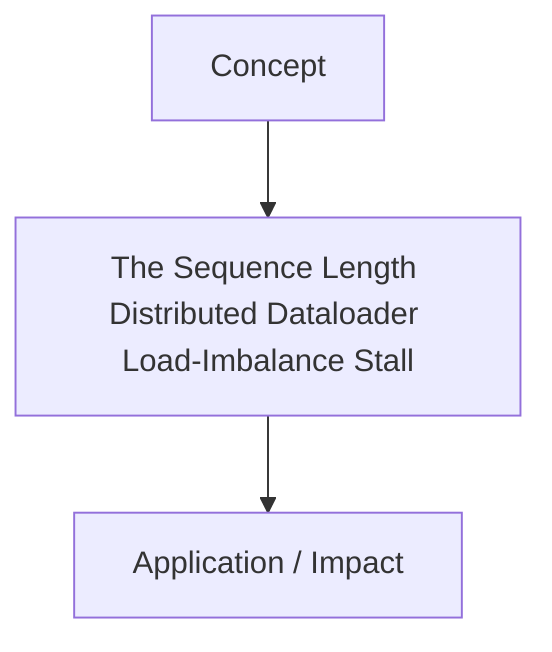

# The Sequence Length Distributed Dataloader Load-Imbalance Stall

[Back to Readme](../README.md)

This page provides detailed information on The Sequence Length Distributed Dataloader Load-Imbalance Stall.

## Information
- **Year:** 2023
- **Paper Link:** [https://arxiv.org/abs/2308.10820](https://arxiv.org/abs/2308.10820)
