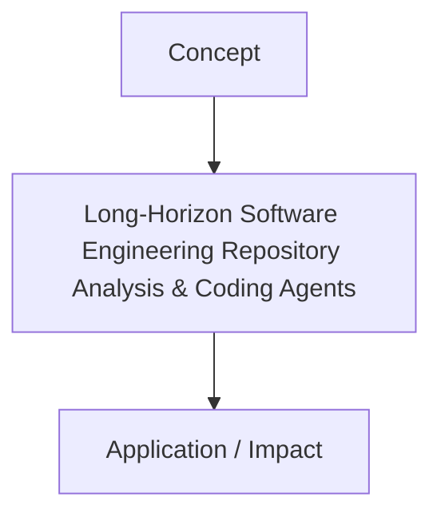

# Long-Horizon Software Engineering Repository Analysis & Coding Agents

[Back to Readme](../README.md)

This page provides detailed information on Long-Horizon Software Engineering Repository Analysis & Coding Agents.

## Information
- **Year:** 2023
- **Paper Link:** [https://arxiv.org/abs/2312.07128](https://arxiv.org/abs/2312.07128)
