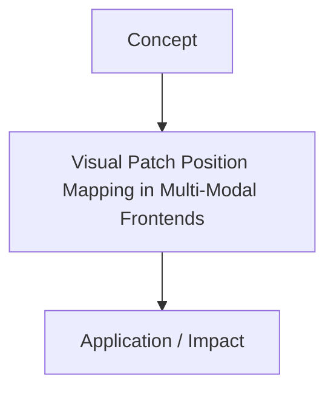

# Visual Patch Position Mapping in Multi-Modal Frontends

[Back to Readme](../README.md)

This page provides detailed information on Visual Patch Position Mapping in Multi-Modal Frontends.

## Information
- **Year:** 2020
- **Paper Link:** [https://arxiv.org/abs/2010.11929](https://arxiv.org/abs/2010.11929)
